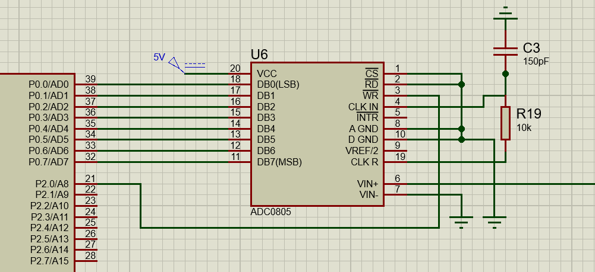
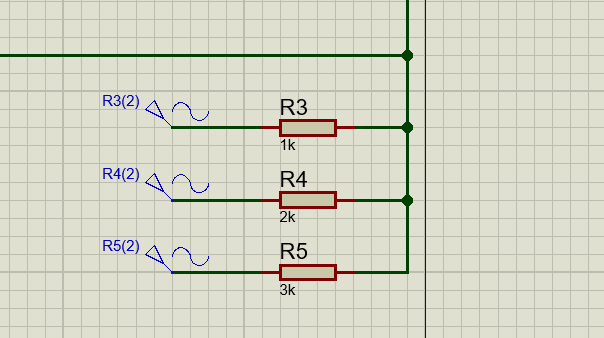
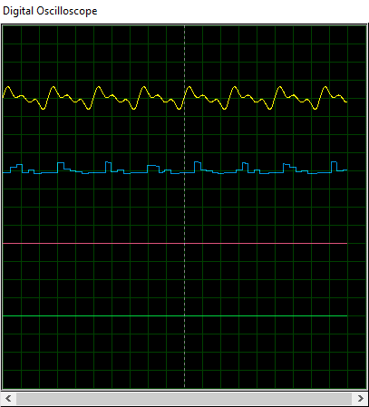

# Final Electronics Projects 

An implementation of a digital filter using ADC0805, DAC0808 & intel-8051 chip. 

## <u>Files</u> 

Project contents are :

| Directory   | Description                                         |
| ----------- | --------------------------------------------------- |
| keilsim     | A directory containing all Keil Simulation files    |
| lib         | A directory containing all implemented drives       |
| proteus sim | A directory containing all Proteus Simulation files |

just find the main file in each directory and run to find the desired output.

## <u>Components</u>

#### DAC 

As the name implies it takes a digital set of bin as its input from Port 1 and output on single analog output at C2

where Vref =5 V


As the Software:
all it do is to put the signal you want to output as the hex value after multiplications it with 255 and dividing it by Vref

```C
P1=0xFF;//to output 5 V

P1= 2.5*255/5// to output 2.5 V
```

**How Does it Work**

The chip DAC0808.It takes 8 digital bins and Vref+=5 and Vref-=0 since it will work with digital and output a current.
a current that can be taken to a electric feedback loop to turn it to voltage so we can be able to measure it.
The ratio from the op amp is 5k/1K=5
so our output will range between 0 and 5 volt 
if you change the resistor 5 K to 10 K then the output volt will range from 0 to 10 V
and if the input Pins changed it will change depending on this equation
where Iref=1mA	
the Calculation inside the Dac is:


#### ADC

A classic analog to digital converter 0805 which provides a variety of modes, using Ready-Output mode to provide quick outputs and simple code.

Writing a low-high edge on 0805 drives the converter to read the current input and convert the result on the data pins, we then connected these pins on 8051 to filter these results.

**Connection** 

Putting CS, RD, A GND ad D GND on ground and connecting the WR pin to P2.0 sets the adc to Ready-Output mode



**Working**

Using Timer 0 Interrupt and mode 1 we implemented an 1 ms interrupt, each interrupt will apply a low-high edge on 0805 provoking reading and writing at the same time. Results are pinned to 8051 P0 port. 

```c

void write_adc(void)
{
	// Apply a low to high edge
	write = 0;
	write = 1;
}
void ISR_timer2 (void) interrupt 1
{
	TF0 = 0;
	write_adc();
    // Filter Mode 
    FLITER_CTR = 6 ;
    inputSignal[0] = adc1;
    HPF();
    P1 = outputSignal[0];
    SHIFT_REG(FLITER_CTR);
    // Input Output mode 	
	// P1 = adc1; 
}
```

## <u>Results</u>

#### Input

Applying a weighted summer on 0805 input 



#### Output 

Yellow signal is the weighted summer and the blue one is the output of DAC0808, due to quaternization errors the output is not perfectly the same but in a close range to the input.  

