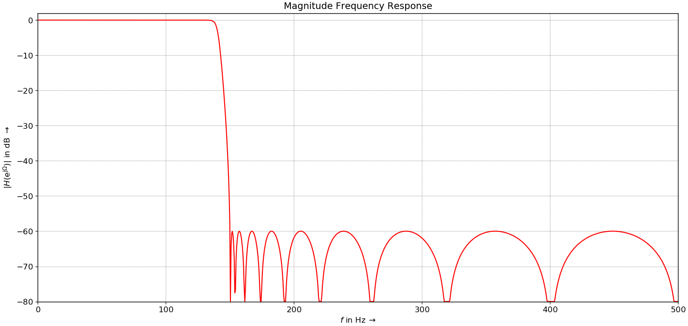
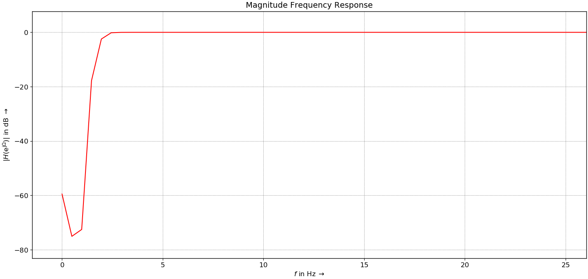
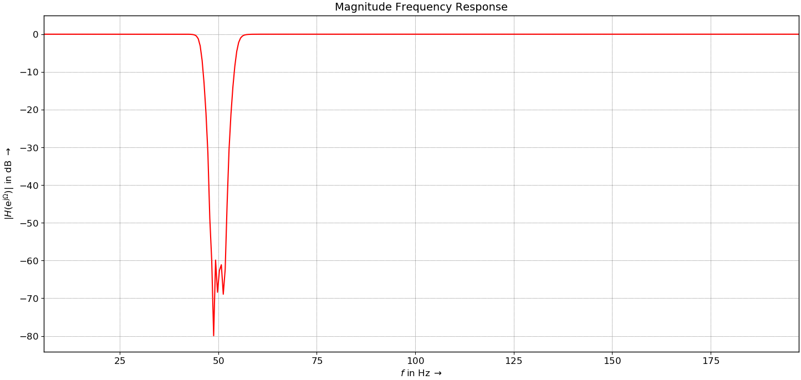

# Final Electronics Projects 

An implementation of a digital filter using ADC0805, DAC0808 & intel-8051 chip. 

## TEAM

| Name              | BN   |
| ----------------- | ---- |
| Sayed Abdullah    | 43   |
| Ahmad Mahdy       | 9    |
| Ahmad Khaled      | 4    |
| Ahmad Alnouby     | 3    |
| Ahmad Abdelmageed | 8    |

## <u>Files</u> 

Project contents are :

| Directory   | Description                                         |
| ----------- | --------------------------------------------------- |
| keilsim     | A directory containing all Keil Simulation files    |
| lib         | A directory containing all implemented drives       |
| proteus sim | A directory containing all Proteus Simulation files |

just find the main file in each directory and run to find the desired output.

## <u>Components</u>

#### DAC 

As the name implies it takes a digital set of bin as its input from Port 1 and output on single analog output at C2

where Vref =5 V


As the Software:
all it do is to put the signal you want to output as the hex value after multiplications it with 255 and dividing it by Vref

```C
P1=0xFF;//to output 5 V

P1= 2.5*255/5// to output 2.5 V
```

**How Does it Work**

The chip DAC0808.It takes 8 digital bins and Vref+=5 and Vref-=0 since it will work with digital and output a current.
a current that can be taken to a electric feedback loop to turn it to voltage so we can be able to measure it.
The ratio from the op amp is 5k/1K=5
so our output will range between 0 and 5 volt 
if you change the resistor 5 K to 10 K then the output volt will range from 0 to 10 V
and if the input Pins changed it will change depending on this equation
where Iref=1mA	
the Calculation inside the Dac is:


#### ADC

A classic analog to digital converter 0805 which provides a variety of modes, using Ready-Output mode to provide quick outputs and simple code.

Writing a low-high edge on 0805 drives the converter to read the current input and convert the result on the data pins, we then connected these pins on 8051 to filter these results.

**Connection** 

Putting CS, RD, A GND ad D GND on ground and connecting the WR pin to P2.0 sets the adc to Ready-Output mode


**Working**

Using Timer 0 Interrupt and mode 1 we implemented an 1 ms interrupt, each interrupt will apply a low-high edge on 0805 provoking reading and writing at the same time. Results are pinned to 8051 P0 port. 

```c

void write_adc(void)
{
	// Apply a low to high edge
	write = 0;
	write = 1;
}
void ISR_timer2 (void) interrupt 1
{
	TF0 = 0;
	write_adc();
    // Filter Mode 
    FLITER_CTR = 6 ;
    inputSignal[0] = adc1;
    HPF();
    P1 = outputSignal[0];
    SHIFT_REG(FLITER_CTR);
    // Input Output mode 	
	// P1 = adc1; 
}
```

## <u>Results</u>

#### Input

Applying a weighted summer on 0805 input 


#### Output 

Yellow signal is the weighted summer and the blue one is the output of DAC0808, due to quaternization errors the output is not perfectly the same but in a close range to the input.  


## <u>Digital Filters</u>

- We used the difference equation to design the filters. The difference equation is a formula for computing an output sample at time `n` based on past and present input samples and past output samples in the time domain.
  We may write the general, causal, LTI difference equation as follows:
  $$
  y(n) = b_0 x(n) + b_1 x(n-1) + ... + b_M x(n-M) + a_1 y(n-1) + a_2 y(n) + ... + a_N y(n-N) \\
  y(n) = \sum_{k=0}^{M} a_k x(n-k) + \sum_{k=1}^{N} b_k y(n-k)
  $$
* The values of `a`  and `b` are calculated based on the filter design using FDA tools. 

* In our design we also considered designing using the IIR filter instead of the FIR filter as we concluded it could be more suitable for the 8051 as they reach faster stabilities per number of orders used. The chebychev 2 is the more popular type in IIR designs.

#### Low Pass Filter
When using an order of 19 with a cut-off frequency of 150 Hz, we generated these values of `a` and `b`.

```c
float code lpf_B[19] = {0.0009329, -0.01249, 0.07975, -0.3237, 0.9395, -2.083, 3.688, -5.398, 6.702, -7.188, 6.702, -5.398, 3.688, -2.083, 0.9395, -0.3237, 0.07975, -0.01249, 0.0009392};
float code lpf_A[19] = {1, -14.52, 99.82, -431.9, 1317, -3008, 5330, -7488, 8459, -7738, 5747, -3456, 1671, -640.2, 190.2, -42.27, 6.618, -0.6512, 0.03032};

```



#### High Pass Filter
When using an order of 6 with a cut-off frequency of 1 Hz, we generated these values of `a` and `b`.

```c
float code hpf_B[6] = {0.99387, -4.969348, 9.93869, -9.93869, 4.96934, -0.99387};
float code hpf_A[6] = {1, -4.98769, 9.95087, -9.92643, 4.951035, -0.98777};
```


#### Notch Filter

When using an order of 11 to notch the 50 Hz frequency, we generated these values of `a` and `b`.

```c
float code notch_B[11] = {0.97215, -9.68492, 43.45451, -115.6363, 202.1097, -242.43024, 202.1097, -115.6363, 43.4545, -9.68492, 0.972154571};
float code notch_A[11] = {1, -9.90605, 44.19583, -116.9456, 203.24584, -242.4194, 200.96285, -114.3331, 42.7231, -9.46841, 0.94508};
```



#### Implementing the difference equation in C

So, the values of `b` are multiplied with the current input and previous values of input, the values of `a` are multiplied with the previous of values of the output and the summation of all the above results in the new output

```c
float idata inputSignal[19];
float idata outputSignal[19];

void LPF()
{
	
	char i;
	outputSignal[0] += (inputSignal[0] * lpf_B[0]);
	for(i = 1; i<19; i++)
	{
		outputSignal[0] += (outputSignal[i] * lpf_A[i] + inputSignal[i] * lpf_B[i]);
	}
}

// The logic in LPF is the same as HPF and NOTCH with only the order being different

```

The ```inputSignal``` is an array that stores the current input (index 0) and previous values of input (index 1, 2, 3, ...) from the ADC to the MC that receives the signal to be filtered as its input.

The ```outputSignal``` is an array that stores the current output (index 0) and the previous values of output (index 1, 2, 3, ...), the MC sends the first index (0) (the current output) to the DAC which convert it to an analog signal to be recorded in the oscilloscope.

#### Problems
Unfortunately, the 8051 in Proteus was having some issues.
1. Precision of floating
Unlike what was written above the values of `a` and `b` contain more than 10 floating numbers. The 8051 may only deal with only 4-5 floating numbers. The accuracy is very affected with even discarding the 10th floating number. 

2. Low Memory Capacitance 
The memory storage of the 8051 isn't the most delightful among the other MCUs. This prevented us from using higher order filters which may be a good solution for the precision problem mentioned above.

3. Proteus
The original 8051 doesn't exist on Proteus, we use an equivalent MCU for simpler tasks. However, it has even lower properties.


