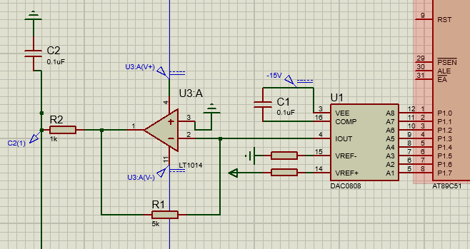

# DAC
As the name implies it takes a digital set of bin as its input from Port 1 and output on single analog output at C2

where Vref =5 V


As the Software:
all it do is to put the signal you want to output as the hex value after multiplications it with 255 and dividing it by Vref
```C
P1=0xFF;//to output 5 V

P1= 2.5*255/5// to output 2.5 V
```

# How Does it Work
The chip DAC0808.It takes 8 digital bins and Vref+=5 and Vref-=0 since it will work with digital and output a current.
a current that can be taken to a electric feedback loop to turn it to voltage so we can be able to measure it.
The ratio from the op amp is 5k/1K=5
so our output will range between 0 and 5 volt 
if you change the resistor 5 K to 10 K then the output volt will range from 0 to 10 V
and if the input Pins changed it will change depending on this equation
where Iref=1mA
the Calculation inside the Dac is:

